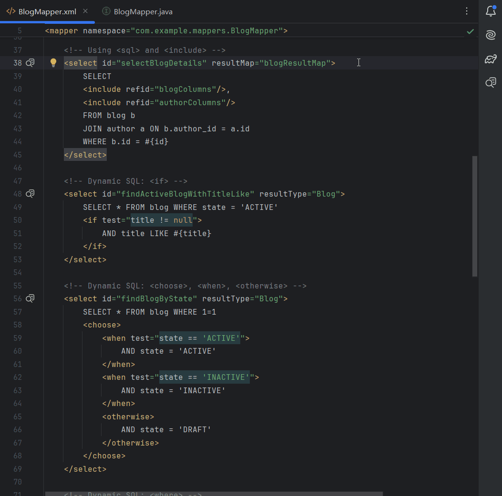

#  VividBatis

[简体中文](README_zh-CN.md)

<!-- Plugin description -->
VividBatis: SQL preview and OGNL highlighting.
This plugin assists with MyBatis dynamic SQL and OGNL expressions.

Key features:

*   **One-Click SQL Preview**: Instantly preview rendered SQL statements directly from mapper XML files. This eliminates the need for project startup and manual debugging.
*   **OGNL Syntax Highlighting**: Provides syntax highlighting for OGNL expressions, including `if`, `choose`, `when`, and `foreach`. This improves readability and helps prevent common errors.
<!-- Plugin description end -->

## Installation

- Using the IDE built-in plugin system:
  
  <kbd>Settings/Preferences</kbd> > <kbd>Plugins</kbd> > <kbd>Marketplace</kbd> > <kbd>Search for "VividBatis"</kbd> >
  <kbd>Install</kbd>
  
- Using JetBrains Marketplace:

  Go to [JetBrains Marketplace](https://plugins.jetbrains.com/plugin/MARKETPLACE_ID) and install it by clicking the <kbd>Install to ...</kbd> button in case your IDE is running.

  You can also download the [latest release](https://plugins.jetbrains.com/plugin/MARKETPLACE_ID/versions) from JetBrains Marketplace and install it manually using
  <kbd>Settings/Preferences</kbd> > <kbd>Plugins</kbd> > <kbd>⚙️</kbd> > <kbd>Install plugin from disk...</kbd>

- Manually:

  Download the [latest release](https://github.com/only52607/VividBatis/releases/latest) and install it manually using
  <kbd>Settings/Preferences</kbd> > <kbd>Plugins</kbd> > <kbd>⚙️</kbd> > <kbd>Install plugin from disk...</kbd>

## License

This project is licensed under the [GNU General Public License, Version 3.0](LICENSE).

---
Plugin based on the [IntelliJ Platform Plugin Template][template].

[template]: https://github.com/JetBrains/intellij-platform-plugin-template