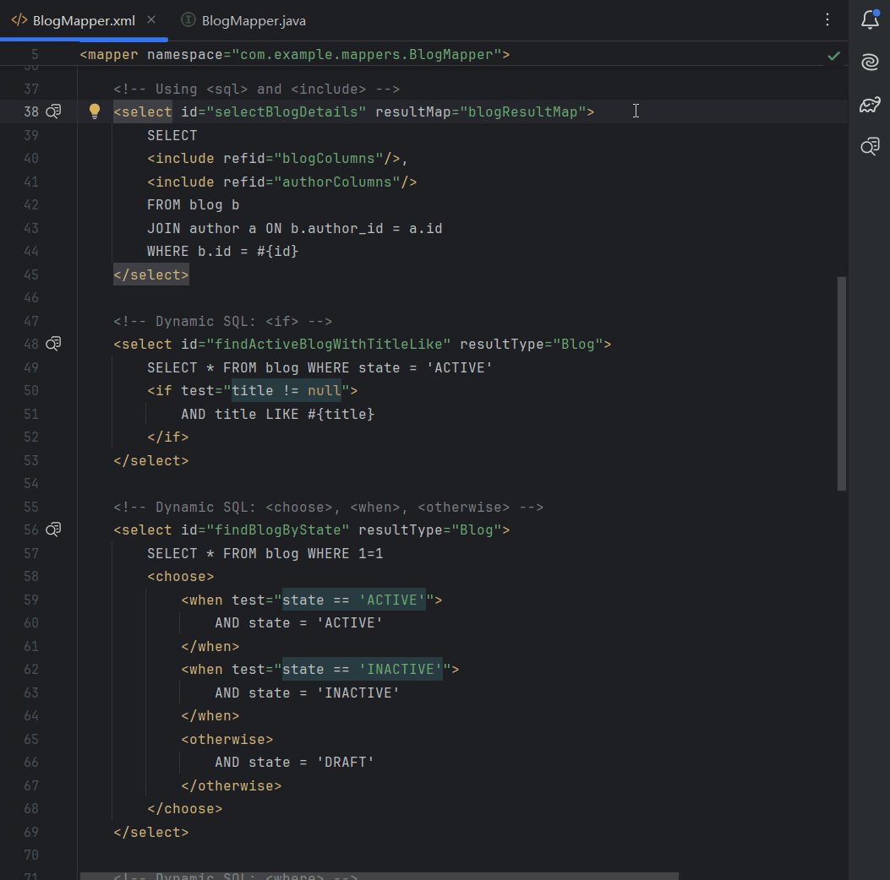

#  VividBatis

<!-- Plugin description -->
厌倦了在MyBatis中调试复杂的动态SQL？还在为OGNL表达式中的拼写错误浪费时间吗？VividBatis将为您排忧解难！

它为您带来两大核心功能：

1.  **一键SQL预览**：在您的mapper XML文件中，只需单击SQL标签旁边的图标，即可立即预览渲染后的SQL语句。告别启动项目和调试的繁琐过程。让您的SQL调试直观高效。

2.  **OGNL语法高亮**：该插件为OGNL表达式提供了清晰醒目的语法高亮。无论是`if`、`choose`、`when`还是`foreach`，一切都一目了然，帮助您轻松编写复杂的动态SQL，避免低级错误。
<!-- Plugin description end -->

## 安装

- 使用IDE内置插件系统：
  
  <kbd>Settings/Preferences</kbd> > <kbd>Plugins</kbd> > <kbd>Marketplace</kbd> > <kbd>搜索 "VividBatis"</kbd> >
  <kbd>安装</kbd>
  
- 使用JetBrains Marketplace：

  前往[JetBrains Marketplace](https://plugins.jetbrains.com/plugin/MARKETPLACE_ID)并通过点击<kbd>安装到...</kbd>按钮进行安装，如果您的IDE正在运行。

  您也可以从[JetBrains Marketplace](https://plugins.jetbrains.com/plugin/MARKETPLACE_ID/versions)下载[最新版本](https://plugins.jetbrains.com/plugin/MARKETPLACE_ID/versions)并手动安装，方法是：
  <kbd>Settings/Preferences</kbd> > <kbd>Plugins</kbd> > <kbd>⚙️</kbd> > <kbd>从磁盘安装插件...</kbd>

- 手动安装：

  下载[最新版本](https://github.com/only52607/VividBatis/releases/latest)并手动安装，方法是：
  <kbd>Settings/Preferences</kbd> > <kbd>Plugins</kbd> > <kbd>⚙️</kbd> > <kbd>从磁盘安装插件...</kbd>

## 许可证

本项目采用[GNU通用公共许可证，版本3.0](LICENSE)授权。

---
插件基于[IntelliJ Platform Plugin Template][template]。

[template]: https://github.com/JetBrains/intellij-platform-plugin-template